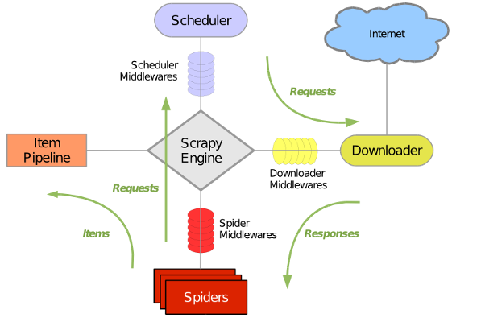

# Scrapy入门教程

## 1.一个简单的案例

以一个电影网站数据爬取为例的入门案例 目标网站 http://www.meijutt.com/new100.html

### 1.1安装

```sh
pip install scrapy
```

### 1.2创建一个项目

```sh
# 创建项目
scrapy startproject movie
# 进入项目
cd movie
# 生成爬虫模板 爬虫模板一般是根据网站域名命名的
scrapy genspider meiju http://meijutt.com
```

创建完成之后项目的目录结构

```
.
├── movie
│   ├── __init__.py
│   ├── items.py
│   ├── middlewares.py
│   ├── pipelines.py
│   ├── __pycache__
│   │   ├── __init__.cpython-36.pyc
│   │   └── settings.cpython-36.pyc
│   ├── settings.py
│   └── spiders
│       ├── __init__.py
│       ├── meiju.py
│       └── __pycache__
│           └── __init__.cpython-36.pyc
└── scrapy.cfg
```

- `scrapy.cfg`: 项目的配置文件
- `movie/`: 该项目的python模块。之后您将在此加入代码。
- `movie/items.py`: 项目中的item文件.
- `movie/pipelines.py`: 项目中的pipelines文件.
- `movie/settings.py`: 项目的设置文件.
- `movie/spiders/`: 放置spider代码的目录.

### 1.3定义Item

Item 是保存爬取到的数据的容器；其使用方法和python字典类似， 并且提供了额外保护机制来避免拼写错误导致的未定义字段错误。

类似在ORM中做的一样，您可以通过创建一个 [`scrapy.Item`](http://scrapy-chs.readthedocs.io/zh_CN/0.24/topics/items.html#scrapy.item.Item) 类， 并且定义类型为 [`scrapy.Field`](http://scrapy-chs.readthedocs.io/zh_CN/0.24/topics/items.html#scrapy.item.Field) 的类属性来定义一个Item。

```python
import scrapy

# 只存放电影的名字
class MovieItem(scrapy.Item):
    # define the fields for your item here like:
    # name = scrapy.Field()
    name = scrapy.Field()
```

### 1.4编写爬虫

`meiju.py`在这里编写主要的处理逻辑

```python
import scrapy
from movie.items import MovieItem
from bs4 import BeautifulSoup

class MeijuSpider(scrapy.Spider):
    name = 'meiju' # 定义爬虫的名字
    allowed_domains = ['meijutt.com']
    start_urls = ['http://www.meijutt.com/new100.html'] # 开始列表

    def parse(self, response):
        # 自带的选择器还没有掌握，发现可以用bs4，先用着
        soup = BeautifulSoup(response.body,"lxml") # response.body中包含着网页源码
        movies = soup.find_all('ul',class_="top-list")[0].find_all("li")
        for movie in movies:
            name = movie.find('a').get_text()
            item = MovieItem()
            item['name'] = name
            yield item # 需要把item转成生成器
```

### 1.5Pipeline

编写数据处理脚本，如数据存储等在这里进行编写`pipelines.py`

```PYTHON
class MoviePipeline(object):
    def process_item(self, item, spider):
        with open("my_meiju.txt",'a',encoding="utf-8") as fp:
            fp.write(item['name']+'\n')
```

### 1.6 settings

```python
# 设置处理返回数据的类及执行优先级
ITEM_PIPELINES = {'movie.pipelines.MoviePipeline':100}
```

## 2.Scrapy大致介绍

### 2.1Scrapy整体的架构

Scrapy主要包括了以下组件：

- - **引擎(Scrapy)**
    *用来处理整个系统的数据流, 触发事务(框架核心)*
  - **调度器(Scheduler)**
    *用来接受引擎发过来的请求, 压入队列中, 并在引擎再次请求的时候返回. 可以想像成一个URL（抓取网页的网址或者说是链接）的优先队列, 由它来决定下一个要抓取的网址是什么, 同时去除重复的网址*
  - **下载器(Downloader)**
    *用于下载网页内容, 并将网页内容返回给蜘蛛(Scrapy下载器是建立在twisted这个高效的异步模型上的)*
  - **爬虫(Spiders)**
    *爬虫是主要干活的, 用于从特定的网页中提取自己需要的信息, 即所谓的实体(Item)。用户也可以从中提取出链接,让Scrapy继续抓取下一个页面*
  - **项目管道(Pipeline)**
    *负责处理爬虫从网页中抽取的实体，主要的功能是持久化实体、验证实体的有效性、清除不需要的信息。当页面被爬虫解析后，将被发送到项目管道，并经过几个特定的次序处理数据。*
  - **下载器中间件(Downloader Middlewares)**
    *位于Scrapy引擎和下载器之间的框架，主要是处理Scrapy引擎与下载器之间的请求及响应。*
  - **爬虫中间件(Spider Middlewares)**
    *介于Scrapy引擎和爬虫之间的框架，主要工作是处理蜘蛛的响应输入和请求输出。*
  - **调度中间件(Scheduler Middewares)**
    *介于Scrapy引擎和调度之间的中间件，从Scrapy引擎发送到调度的请求和响应。*



Scrapy运行流程大概如下：

1. 引擎打开一个网站(open a domain)，找到处理该网站的Spider并向该spider请求第一个要爬取的URL(s)。
2. 引擎从Spider中获取到第一个要爬取的URL并在调度器(Scheduler)以Request调度。
3. 引擎向调度器请求下一个要爬取的URL。
4. 调度器返回下一个要爬取的URL给引擎，引擎将URL通过下载中间件(请求(request)方向)转发给下载器(Downloader)。
5. 一旦页面下载完毕，下载器生成一个该页面的Response，并将其通过下载中间件(返回(response)方向)发送给引擎。
6. 引擎从下载器中接收到Response并通过Spider中间件(输入方向)发送给Spider处理。
7. Spider处理Response并返回爬取到的Item及(跟进的)新的Request给引擎。
8. 引擎将(Spider返回的)爬取到的Item给Item Pipeline，将(Spider返回的)Request给调度器。
9. (从第二步)重复直到调度器中没有更多地request，引擎关闭该网站。


## 3.常用的命令

* 创建项目: `scrapy startproject <projectname>`
* 创建爬虫：`scrapy genspider <name> <domain>`
* 运行爬虫：`scrapy crawl myspider`
* 列出项目中可用的爬虫：`scrapy list`