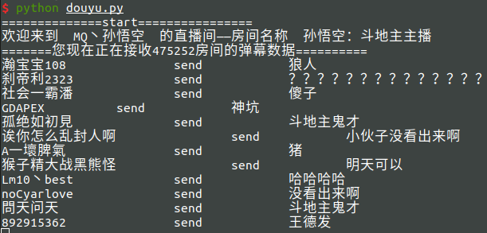
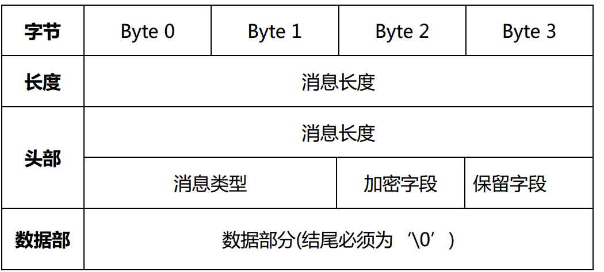

# 斗鱼弹幕数据抓取

主要参考斗鱼的文档 http://dev-bbs.douyutv.com/forum.php?mod=forumdisplay&fid=37



## 建立连接

通过 socket 与弹幕服务器建立连接

```
第三方接入弹幕服务器列表：
IP 地址： openbarrage.douyutv.com 端口： 8601
2019-12-11 最新 ip 地址 119.96.201.28
```

## 发送消息

协议组成



**消息长度**： 4 字节小端整数，表示整条消息（包括自身）长度（字节数）。消息长度出现两遍，二者相同

**消息类型**： 2 字节小端整数， 表示消息类型。取值如下：
689 客户端发送给弹幕服务器的文本格式数据
690 弹幕服务器发送给客户端的文本格式数据

**加密字段**： 暂时未用，默认为 0。
**保留字段**： 暂时未用，默认为 0。

**数据部分**：斗鱼独创序列化文本数据，结尾必须为‘\0’。

msg 是要发送的数据部分，实际是要加上长度 4 头部 4+4 个字节长度的，也就是 12 个但是实际发出去的时候会自动加 4 个，所以+8

```python
msg = msg.encode()
code = 689 # 客户端发送给弹幕服务器
msg_length = len(msg) + 8  # 加 8 就行 不行换12
head = struct.pack('i',msg_length) + struct.pack('i',msg_length) + struct.pack('i',code)
self.socket.sendall(head+msg)
```

## 登录

登录弹幕服务器，不需要输入用户名和密码，应该是和游客模式一样

```python
login = f"type@=loginreq/roomid@={self.room_id}/\x00"
```

## 加入弹幕组

默认加入弹幕组`-9999`,海量弹幕组

```python
joingroup = f"type@=joingroup/rid@={self.room_id}/gid@=-9999/\x00"
```

## 心跳消息

保持于弹幕服务器的连接 每隔 45 秒发送心跳信息

```python
msg = f"type@=keeplive/tick@={t}/\x00"
```

## 解析消息

正则匹配返回的内容，然后转成 Python 对象，其中会存在不能转为 utf-8 的表情符号`UnicodeDecodeError: 'utf-8' codec can't decode byte 0xed in position 75: invalid continuation byte` 忽略这个错误

```python
content_obj = {}
# print(content)
content = content.decode(errors='replace').strip()
tmp_kv_list = content.split('/')
for kv in tmp_kv_list:
    kv = kv.strip()
    if len(kv) == 0:
        continue
    kv = kv.split("@=")
    content_obj[kv[0]]=kv[1]
return content_obj

```

## 之后可能会做

暂时就是为了好玩，没有做持久化处理，之后可能会做

​
