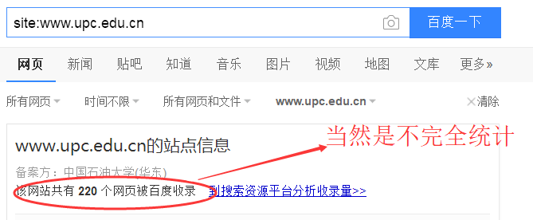

# 网络信息采集

在编写爬虫之前可能需要先了解和搜集网站信息

## robots.txt

>Robots协议（也称为爬虫协议、机器人协议等）的全称是“网络爬虫排除标准”（Robots Exclusion Protocol），网站通过Robots协议告诉搜索引擎哪些页面可以抓取，哪些页面不能抓取。一般的网站都会有这个文件。可以大致了解这个网站存在哪些限制

下面是知乎的robots.txt，可以通过https://www.zhihu.com/robots.txt访问
```
# 禁止今日头条和悟空问答爬虫抓取知乎网站内容
User-agent: *
Request-rate: 1/2 # load 1 page per 2 seconds
Crawl-delay: 10

Disallow: /login
Disallow: /logout
Disallow: /resetpassword
Disallow: /terms
Disallow: /search
Disallow: /notifications
Disallow: /settings
Disallow: /inbox
Disallow: /admin_inbox
Disallow: /*?guide*
Disallow: /people/*
```
其中User-agent说明了对哪些用户代理的限制，`*`表示限制所有的爬虫，还设置了请求速率 每两秒访问一个页面，还设置了Crawl-delay，10秒的抓取延时，为了知乎的服务器不过载，我们最好遵循一下？？？？后面的Disallow则限制了访问的路径

## 用site:example.com估计网站的大小
你想抓取信息的网站有九成是被百度或者Google访问过的，通过这条命令可以快速的了解网站的大小，以便在设计爬虫的时候选择合适的方案



## 识别网站所用的技术

安装builtwith模块
```
pip install builtwith
```

使用方式
```python
import builtwith as bw
res = bw.parse("https://www.zhihu.com/")
print(res)
# {'javascript-frameworks': ['React', 'RequireJS']}
res = bw.parse("https://www.upc.edu.cn/")
print(res)
# {'font-scripts': ['Font Awesome'], 'javascript-frameworks': ['jQuery']}
res = bw.parse("http://example.webscraping.com")
print(res)
#{'web-servers': ['Nginx'], 'web-frameworks': ['Web2py', 'Twitter Bootstrap'], 'programming-languages': ['Python'], 'javascript-frameworks': ['jQuery', 'Modernizr', 'jQuery UI']}
```
可以得知知乎使用的是React框架，还能知道网站用什么语言开发的，服务器类型等等