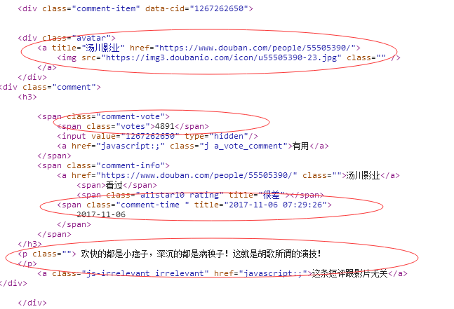

# 抓取豆瓣影评评分

## 正常的抓取

* 分析请求的url
```
https://movie.douban.com/subject/26322642/comments?start=20&limit=20&sort=new_score&status=P&percent_type=
```
里面有用的也就是`start`和`limit`参数，我尝试过修改`limit`参数，但是没有效果，可以认为是默认的
`start`参数是用来设置从第几条数据开始查询的

* 设计查询列表，发现页面中有url中的查询部分，且指向下一个页面


于是采用下面的代码进行判断是否还有下一个页面
```python
if next_url:
        visit_URL('https://movie.douban.com/subject/24753477/comments'+next_url)
```

* 用requests发送请求，beautifulsoup进行网页解析


* 把数据写入txt

## 模仿移动端

很多时候模仿移动端获得的页面会比PC端的简单，更加容易解析，这次模拟移动端，发现可以直接访问api获取json格式的数据，nice!


至于怎么模拟移动端只需要将`user-agent`修改为移动端的头
```python
useragents = [
    "Mozilla/5.0 (iPhone; CPU iPhone OS 9_2 like Mac OS X) AppleWebKit/601.1 (KHTML, like Gecko) CriOS/47.0.2526.70 Mobile/13C71 Safari/601.1.46",
    "Mozilla/5.0 (Linux; U; Android 4.4.4; Nexus 5 Build/KTU84P) AppleWebkit/534.30 (KHTML, like Gecko) Version/4.0 Mobile Safari/534.30",
    "Mozilla/5.0 (compatible; MSIE 9.0; Windows Phone OS 7.5; Trident/5.0; IEMobile/9.0)"
]
```
怎么获取这些头部？用火狐的插件user-agent switcher

之后的操作就是解析json