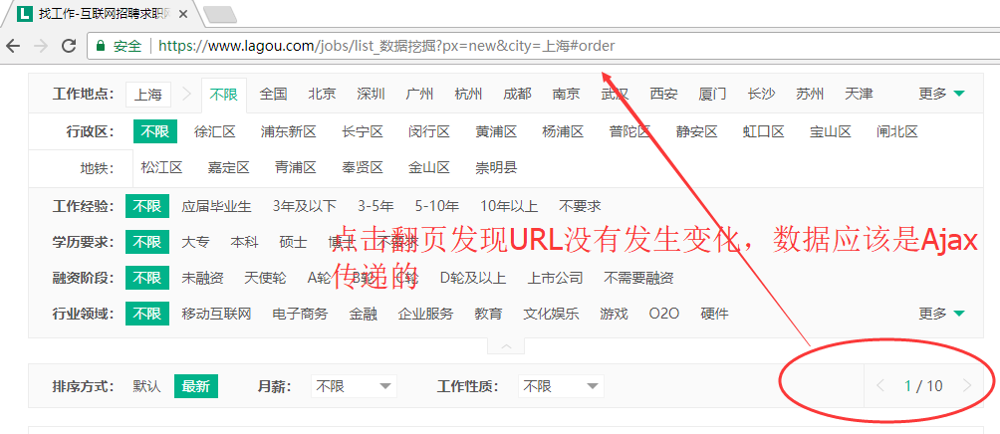
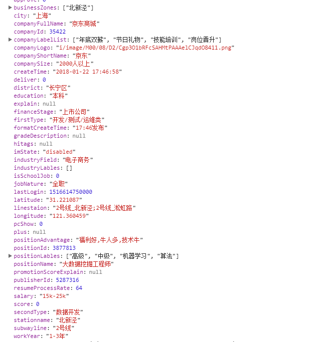
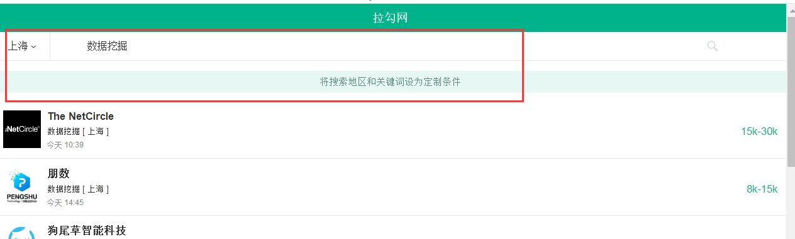
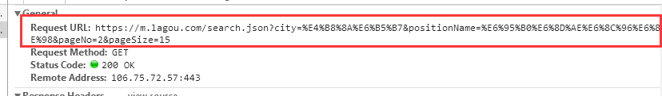
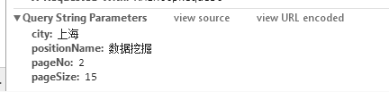
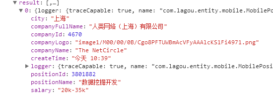
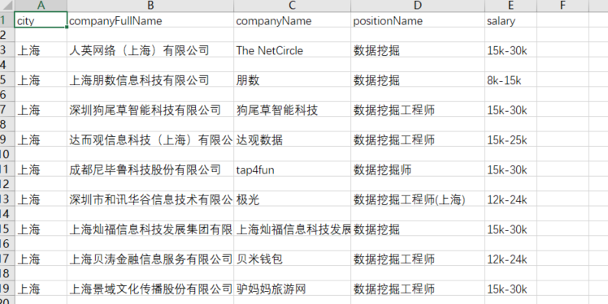

# 拉勾网数据爬取

## 爬取内容
北京，上海，杭州，南京，成都5个城市最新发布的数据挖掘方向的岗位数据
岗位数据包括:地点，公司，岗位名称，薪资，基本要求

## 方案
正常的
```
https://www.lagou.com/jobs/list_数据挖掘?px=new&city=上海#order
```
上面的URL是查询上海数据挖掘岗位的信息并按照最新发布排序


通过抓包分析请求的真正URL是这个
```
https://www.lagou.com/jobs/positionAjax.json?px=new&city=上海&needAddtionalResult=false&isSchoolJob=0
```

提交的数据如下


返回的数据的格式如下


使用移动端ua (很赞)

设置查询条件


然后用F12抓包分析真正的URL



发送数据的表单



获得数据格式


成果展示
